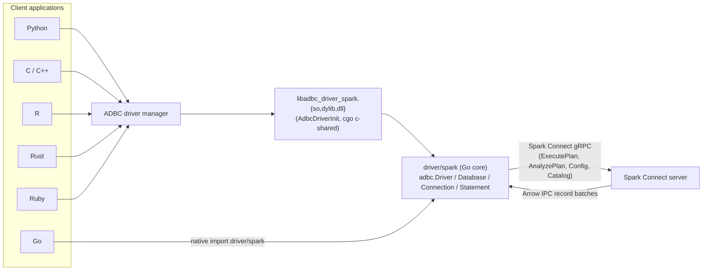
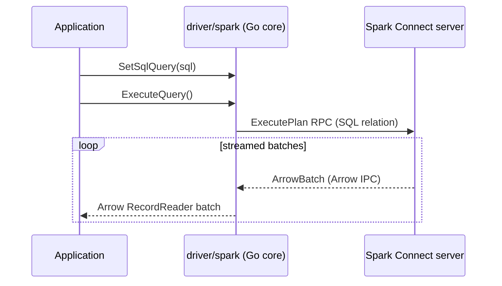

<!-- SPDX-License-Identifier: Apache-2.0 -->
# Architecture

This page explains how the driver turns ADBC calls into **Apache Spark Connect**
gRPC traffic, and how a single Go core reaches every language.

## One core, many languages

The driver is written once, in Go, under `driver/spark`. That core implements
the standard `github.com/apache/arrow-adbc/go/adbc` interfaces (Driver,
Database, Connection, Statement). It reaches different languages two ways:

- **Native Go.** Go programs import `driver/spark` and use the ADBC interfaces
  directly. No cgo, no shared library.
- **C-ABI shared library.** The `c/` package compiles the Go core with cgo and
  `-buildmode=c-shared` into `libadbc_driver_spark.{so,dylib,dll}`. It exports
  the standard `AdbcDriverInit` entrypoint (and a `AdbcDriverSparkInit` alias),
  so any ADBC driver manager (Python, R, C/C++, Ruby, Rust) can load it.

## Talking to Spark Connect

A connection is a gRPC channel to the Spark Connect server addressed by the
`sc://host:port` URI. TLS and bearer-token credentials, custom headers, the user
agent, and the session id are all negotiated when the channel opens. See
[Connecting and Authentication](connecting.md).

### Executing queries

`SetSqlQuery` builds a Spark Connect SQL relation, and `ExecuteQuery` submits it
through the `ExecutePlan` RPC. The server responds with a stream of Arrow IPC
record batches, which the driver decodes and surfaces as an ADBC result reader.
Because Spark already speaks Arrow over the wire, there is no row-by-row
conversion in the driver: batches flow through to your application largely
untouched.

### Reattachable execution

Long-running queries use Spark Connect's reattachable execution. The driver
tracks the operation id and can resume a result stream with `ReattachExecute`
if the underlying connection is interrupted mid-stream, then issues
`ReleaseExecute` once the result is fully consumed. This makes large result sets
resilient to transient network hiccups.

### Result chunking

Results are delivered as a sequence of batches rather than one monolithic
payload. The driver prefetches a bounded number of batches (tunable with
`adbc.rpc.result_queue_size`) and hands them to the reader as they arrive, so
memory stays flat even for very large results. See
[Querying Data](querying.md).

## Schemas with AnalyzePlan

For metadata that does not require running a query, the driver uses the
`AnalyzePlan` RPC. `GetTableSchema`, for instance, asks Spark to analyze a
relation and returns its Arrow schema without materializing any rows. This is
cheaper and side-effect free compared with executing a probe query.

## Metadata via catalog relations

`GetObjects`, `GetTableTypes`, and related metadata calls are built from Spark
Connect catalog relations (the same relations behind `SHOW CATALOGS`,
`SHOW DATABASES`, and `SHOW TABLES`). The driver submits these through
`ExecutePlan`, reads the Arrow result, and reshapes it into the ADBC metadata
schema. Column and table types follow the [Type Mapping](type-mapping.md).

## Sessions and configuration

Each connection maps to a Spark Connect session. Supplying a `session_id` reuses
an existing session, so temporary views and session configuration persist across
connections. Session configuration values are read and written through the
`Config` RPC.

!!! note
    Spark Connect is autocommit only, so the driver has no transaction state to
    manage. Transaction operations report `ADBC_STATUS_NOT_IMPLEMENTED`. See
    [Compatibility](compatibility.md).
